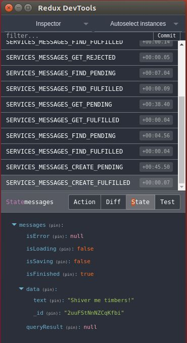

## feathers-reduxify-services

Wrap Feathers services so they work transparently and perfectly with Redux.

[](https://travis-ci.org/eddyystop/feathers-reduxify-services)
[](https://coveralls.io/github/eddyystop/feathers-reduxify-services?branch=master)

> Integrate Feathers and Redux with one line of code.

```javascript
const services = reduxifyServices(feathersApp, ['users', 'messages']);

store.dispatch(services.messages.get('557XxUL8PalGMgOo'));
store.dispatch(services.messages.find());
store.dispatch(services.messages.create({ text: 'Shiver me timbers!' }));
```

[](https://chrome.google.com/webstore/detail/redux-devtools/lmhkpmbekcpmknklioeibfkpmmfibljd?utm_source=chrome-app-launcher-info-dialog)


## Code Example

Expose action creators and reducers for Feathers services. Then use them like normal Redux.

```javascript
import reduxifyServices, { getServicesStatus } from 'feathers-reduxify-services';
const feathersApp = feathers().configure(feathers.socketio(socket)) ...
// Expose Redux action creators and reducers for Feathers' services
const services = reduxifyServices(feathersApp, ['users', 'messages']);
...
// Create Redux store
const store = createStore(
  // Reducers
  users: services.users.reducer,
  messages: services.messages.reducer,
  // Required middleware
  applyMiddleware(reduxThunk, reduxPromiseMiddleware())
)
...
// Invoke Feathers' services using standard Redux.
store.dispatch(services.messages.get('557XxUL8PalGMgOo'));
store.dispatch(services.messages.find());
store.dispatch(services.messages.create({ text: 'Shiver me timbers!' }));
```

Dispatch Redux actions on Feathers' real time service events.

```javascript
const messages = feathersApp.service('messages');
messages.on('created', data => {
  store.dispatch(
    // Create a thunk action to invoke the function.
    services.messages.on('created', data, (eventName, data, dispatch, getState) => {
      console.log('--created event', data);
    })
  );
});
```

Keep the user informed of service activity.

```javascript
const status = getServicesStatus(servicesRootState, ['users', 'messages']).message;
```

## Motivation

To do.

## Installation

Install [Nodejs](https://nodejs.org/en/).

Run `npm install feathers-reduxify-services --save` in your project folder.

You can then require the utilities.

`/src` on GitHub contains the ES6 source.

## Running the Example

To do.

## API Reference

See Code Example.
Each module is fully documented.

## Tests

`npm test` to run tests.

`npm run cover` to run tests plus coverage.

## Contributors

- [eddyystop](https://github.com/eddyystop)

## License

MIT. See LICENSE.